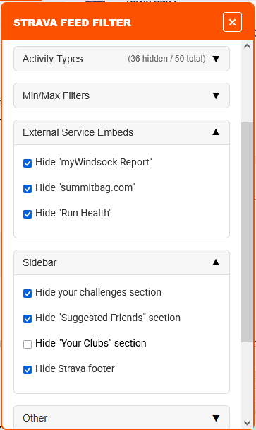
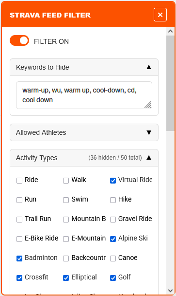
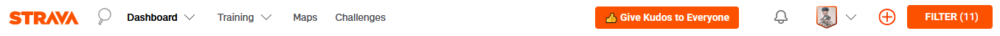

# Strava Feed Filter

A powerful Tampermonkey userscript that provides advanced filtering
capabilities for your Strava activity feed. Built with a modular architecture
for maximum performance and maintainability.

> Note: As of v1.2.4, this project includes Firefox Extension (desktop and Android). As of v2.2.5, Chrome Extension with complete feature parity is also available. As of v2.3.1, a Safari iOS–compatible userscript (`userscript/sff-safari.user.js`) is available. The userscript remains available for all browsers.


*Filter panel*

## Description

This userscript enhances your Strava experience by providing comprehensive
filtering capabilities directly on your feed. Hide activities based on
keywords, activity types, distance, duration, elevation, pace, and more.
The script features a clean, draggable interface that works seamlessly
with Strava's design.

## 🆕 What's New

- Latest: v2.3.1 — Safari iOS userscript, Commute filter, Wandrer embed filtering, Kudos visibility preference, UI tweaks.
- Read the full history in the Changelog: [CHANGELOG.md](./CHANGELOG.md)

## ✨ Key Features

### 🎯 Advanced Filtering Options

- **Keyword Filtering**: Hide activities containing specific keywords in titles
- **Activity Type Filtering**: Granular control over 40+ activity types
  (Run, Ride, Virtual activities, etc.)
- **Distance Filtering**: Set minimum and maximum distance thresholds
- **Duration Filtering**: Filter by activity time (minutes)
- **Elevation Filtering**: Control based on elevation gain
- **Pace Filtering**: Filter running activities by pace (min/km or min/mi)
- **Map Filtering**: Hide activities without GPS maps
- **Commute Tag Filtering**: Hide activities marked with the Commute tag
- **Club Posts**: Option to hide club-related posts
- **Challenge Filtering**: Hide your challenges section
- **Hide Joined Challenges**: Hide athletes' joined challenge cards from the feed
- **External Service Embeds Filtering**: Option to hide text embeds from third-party services in activity descriptions (e.g., myWindsock report, summitbag.com, Run Health, Wandrer)
- **UI Sections Hiding**: Hide "Suggested Friends" and "Your Clubs" sections site-wide

### 🎨 User Interface

- **Responsive Design**: Adapts to different screen sizes and Strava layouts
- **Draggable Panel**: Move the settings panel anywhere on screen
- **Collapsible Sections**: Organized dropdown sections for easy navigation
- **Real-time Updates**: See filtering results immediately as you adjust
  settings
- **Global Settings**: Hide elements like "Give a Gift" button across all
  Strava pages
- **Sidebar Dropdown**: New dropdown in the separate sidebar for quick access
- **Panel Tweaks**: Slightly wider settings panel and an always-visible panel scrollbar to avoid flicker


*Organized sections with collapsible dropdowns*

### 🔧 Smart Functionality

- **Unit System Support**: Switch between Metric and Imperial units
- **Allowed Athletes**: Override filters for specific athletes you always
  want to see
- **Auto-filtering**: Automatically filters new activities as they load
- **Kudos Integration**: Optional "Give Kudos to Everyone" button
- **SPA Navigation**: Works seamlessly with Strava's single-page application

### 🏗️ Technical Excellence

- **Modular Architecture**: Clean separation of concerns (CSS, UI, Logic, Utils)
- **Memory Optimization**: Efficient event handling and DOM manipulation
- **Error Handling**: Robust error handling with graceful fallbacks
- **Performance**: Debounced filtering and optimized DOM queries

## 📱 Responsive Design

The filter adapts to different screen sizes:

- **Desktop**: Full-featured panel with all options
- **Mobile/Tablet**: Compact secondary navigation bar
- **Responsive Button**: Automatically repositions to avoid UI conflicts


*Filter button adapts to different screen sizes*

## 🎛️ Settings Panel

The main settings panel features organized sections:

1. **Master Toggle**: Enable/disable all filtering
2. **Keywords**: Text-based filtering
3. **Allowed Athletes**: Whitelist specific users
4. **Activity Types**: Checkboxes for each activity type with live count
5. **Min/Max Filters**: Distance, duration, elevation, pace controls
6. **Other Options**: Map filtering, club posts, challenges, global settings


*Well-organized filtering options*

## 🚀 Installation

Choose the option that fits your browser/platform.

### Chrome Extension

- Install from Chrome Web Store: https://chromewebstore.google.com/detail/geihkfcdimdmlckcgkebcdajdlmeppff?utm_source=item-share-cb

### Firefox Extension

- Install from Firefox Add-ons: https://addons.mozilla.org/en-US/firefox/addon/strava-feed-filter/

### Userscript (Desktop Browsers)

- Install from Greasy Fork: https://greasyfork.org/en/scripts/550272-strava-feed-filter
- Or install from GitHub (Raw): https://raw.githubusercontent.com/Inc21/Tempermonkey-Strava-Feed-Filter/main/userscript/strava-feed-filter-clean.js
- Manual installation: Download `userscript/strava-feed-filter-clean.js` and install via your userscript manager.

### Userscript (Safari on iOS)

- ▶️ Follow the dedicated guide: [ios-safari-install.md](./ios-safari-install.md)
- Install from GitHub (Raw): [sff-safari.user.js](https://raw.githubusercontent.com/Inc21/Tempermonkey-Strava-Feed-Filter/main/userscript/sff-safari.user.js)
- Manual installation: Download `userscript/sff-safari.user.js` and install manually using your userscript manager.
- Userscripts manager (Quoid): [GitHub](https://github.com/quoid/userscripts) · [App Store](https://apps.apple.com/ie/app/userscripts/id1463298887)

**Disclaimer:** While this userscript is designed to work on multiple browsers, it has been primarily tested on Chrome, Firefox, and Safari. Support for other browsers may vary.

## 📖 Usage Guide

### Getting Started

1. Navigate to your [Strava Dashboard](https://www.strava.com/dashboard)
2. Look for the **"Filter"** button (top-right on desktop, or secondary nav
   on mobile)
3. Click the button to open the settings panel
4. Configure your filtering preferences
5. Activities are filtered in real-time


*Filter button in the Strava interface*

### Page Behavior

- **Dashboard Pages**: Full filtering functionality available
- **Other Strava Pages**: Global settings applied (e.g., "Give a Gift"
  button hiding)
- **Auto-detection**: Script automatically detects page type and applies
  appropriate features

### Filtering Tips

- Use **Keywords** to hide activities with specific terms (e.g., "warm up",
  "recovery")
- Set **Distance ranges** to focus on activities of interest
- Use **Allowed Athletes** to always see activities from favorite users
- **Activity Type** filtering helps reduce clutter from activity types you
  don't follow
- **Pace filtering** is perfect for runners wanting to see only quality workouts

## 🛠️ Configuration Options

### Unit Systems

- **Metric**: Kilometers, meters, min/km
- **Imperial**: Miles, feet, min/mi

### Filter Categories

| Category | Options | Description |
|----------|---------|-------------|
| Keywords | Text input | Hide activities containing specified words |
| Activity Types | 20+ checkboxes | Show/hide specific activity types |
| Distance | Min/Max sliders | Filter by activity distance |
| Duration | Min/Max inputs | Filter by activity time |
| Elevation | Min/Max inputs | Filter by elevation gain |
| Pace | Min/Max inputs | Filter running pace (runs only) |
| Map | Checkbox | Hide activities without GPS data |
| Athletes | Text input | Whitelist specific users |

## 🎨 Customization

### Panel Positioning

- **Drag** the panel by its header to reposition
- **Automatic positioning** under the filter button when opened
- **Viewport constraints**: Panel stays within browser window

### Visual Integration

- **Strava-native styling**: Matches Strava's design language
- **Dark/Light themes**: Adapts to Strava's theme
- **Smooth animations**: Fade in/out transitions
- **Responsive breakpoints**: Mobile-optimized layout

## 🏗️ Architecture

The script uses a clean modular architecture:

```javascript
// CSS Module - All styling centralized
injectStyles()

// Utilities Module - Core functionality
UtilsModule {
    loadSettings(), saveSettings(), debounce(),
    isOnDashboard(), parseDistanceKm(), parseDurationSeconds(),
    parseElevationM()
}

// UI Module - Interface management
UIModule {
    createElements(), updateActivityCount(), updateFilterLabels(),
    applySettings(), setupEvents(), makeDraggable(), keepInViewport()
}

// Logic Module - Business logic
LogicModule {
    filterActivities(), updateGiftVisibility(),
    manageHeaderKudosButton(), setupAutoFilter()
}
```

## 🔧 Developer Information

### Key Technical Features

- **Memory-efficient**: Uses debouncing and optimized DOM queries
- **SPA-compatible**: Handles Strava's single-page application navigation
- **Error resilient**: Comprehensive error handling with fallbacks
- **Browser compatible**: Works across all major browsers
- **Performance optimized**: Minimal impact on Strava's performance

### Contributing

Developed by [Inc21](https://github.com/Inc21). Contributions and suggestions
welcome!

### Support the Developer

If you find this script useful, consider:

- ⭐ Starring the repository
- ☕ [Buy me a coffee](https://www.buymeacoffee.com/inc21)
- 🐛 Reporting bugs or suggesting features: [GitHub Issues](https://github.com/Inc21/Tempermonkey-Strava-Feed-Filter/issues)

## 🔄 Filtering Results

See the difference filtering makes on your Strava feed:

**Before Filtering:**

*Strava feed showing all activities*

**After Filtering:**

*Same feed with filters applied - notice the reduced activity count*

## 🎯 Activity Count Display


*Real-time count showing "(X hidden / Y total)" for activity types*

## Changelog

For the complete release notes, see [CHANGELOG.md](./CHANGELOG.md).
Latest release: v2.3.1 (26.10.2025).

## 📄 License

This project is licensed under the **MIT License**. See the [LICENSE](./LICENSE) file for details.

---

**Note**: This userscript is not affiliated with Strava. It's a community tool
designed to enhance the user experience.
